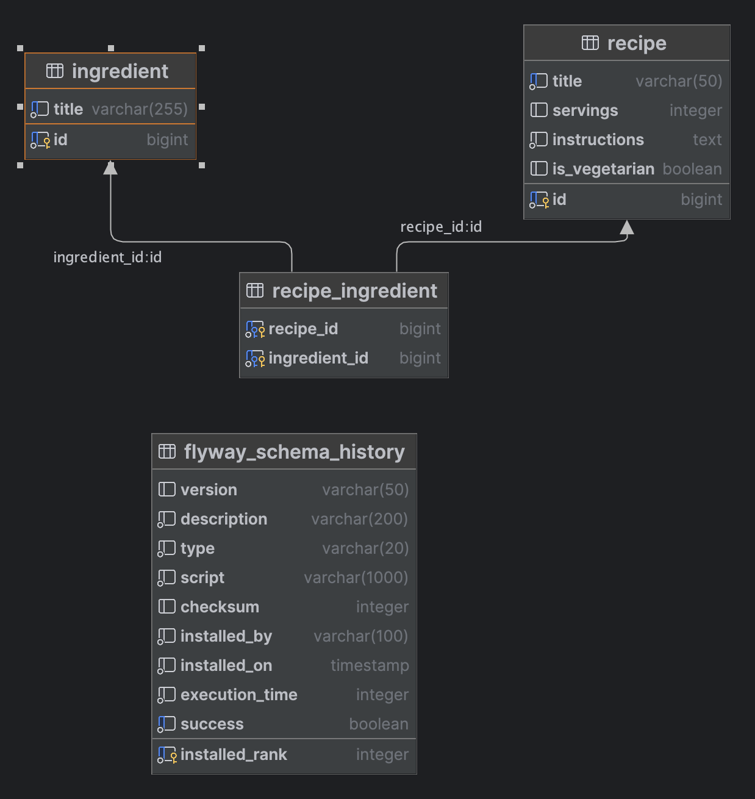

# Recipe Manager Application

## Overview
The Recipe Manager is a standalone Java application that allows users to manage their favorite recipes. It provides CRUD operations for recipes and supports advanced filtering based on various criteria.

## Features
- Add, update, remove, and fetch recipes
- Filter recipes based on:
    1. Vegetarian status
    2. Number of servings
    3. Specific ingredients (include or exclude)
    4. Text search within instructions

## Technologies Used
- Java
- Spring Boot
- Spring Data JPA
- PostgreSQL (as the database)
- Spring MVC for RESTful API
- Maven for dependency management
- Flyway for database migrations

## Project Structure
The project is organized into the following main packages:
- `com.abn.amro.assignment`: Main package
    - `configuration`: Exceptions and Api config
    - `controller`: REST API controllers
    - `exception`: Exceptions
    - `model`: Entity classes and DTOs and mappers
    - `repository`: Spring Data JPA repositories
    - `service`: Business logic and services
    - `search`: Search criteria, Request object and validator

## Database Setup
1. For the testing H2 DB is used
2. For actual run postgress database is used. Configured in compose.yml
3. DB Architecture: 


## Future Improve
I tried to cover as much as possible in limited time given. 
It is first production ready version but there is list of improvements for next version:
1. Search functional can be reviewed and simplify.
2. Exception handling can be improved.
3. Ingredient controller is working but not in use.
4. More test coverage.
5. More explicit configurations(now a lot is auto spring setups).
6. DB credential should be protected.
7. Add UI for simpler usage of the app.
8. User management. 

## How to run?

The application can be run by the following steps.
<br/>

### Prerequisites

The following app should be installed before running the application:

- Docker Desktop. For more information regarding the system requirements, etc. refer to the following pages:

[Install on Mac](https://docs.docker.com/desktop/install/mac-install/)<br/>
[Install on Windows](https://docs.docker.com/desktop/install/windows-install/)<br/>
[Install on Linux](https://docs.docker.com/desktop/install/linux-install/)<br/>

<br/>

## Running the Application
```bash
docker compose up -d
```
```bash
mvn spring-boot:run 
```
Go to [SwaggerUi](http://localhost:8080/swagger-ui/index.html) 

After compiling swagger documentation is available at: [Api Docs](http://localhost:8080/v3/api-docs)
